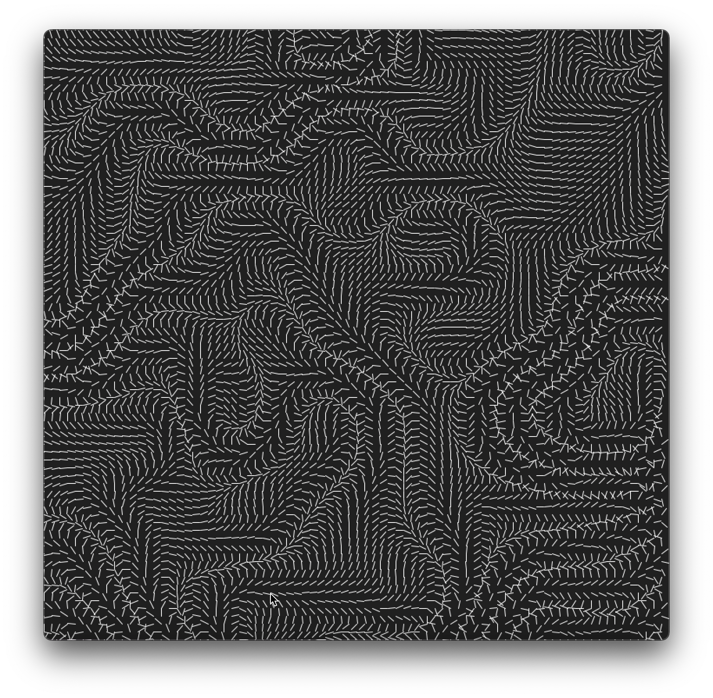
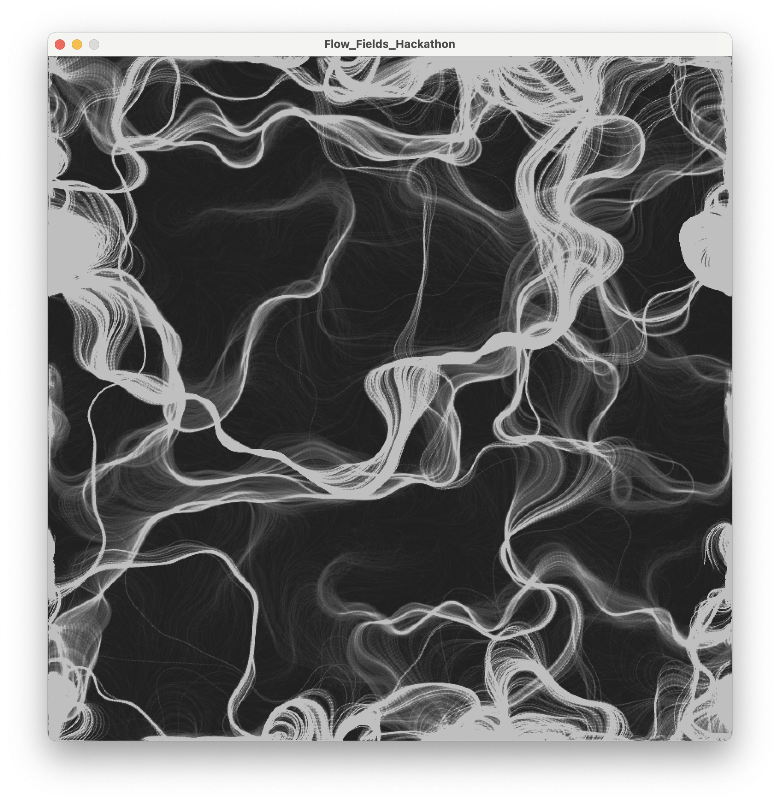

# Flow Fields - Hackathon Project
This is a simulation of flow fields realized in Processing(Java) under a 4-hour time constraint

Credit to The Coding Train for the helpful guide found [here](https://www.youtube.com/watch?v=BjoM9oKOAKY&list=PLJ4719mkxmAg438ROtpsuNQJ5CPqe70jx&index=20&t=19s&pp=gAQBiAQB). Much of this project was adapting this to work in Processing, along with some fun individual exploration of vector and flow fields.

The entire project, along with pictures and videos, can be found on my [Behance](https://www.behance.net/gallery/185467187/Flow-Fields-Hackathon-Project).

## At a glance
The flow field is created by simulating ten thousand particles moving across a field of vectors. The vectors are semi-randomly determined using a Perlin Noise function. As the simulation runs, the vectors slowly change using the third dimension of the noise function. A visualization of the vector field can be seen below:

